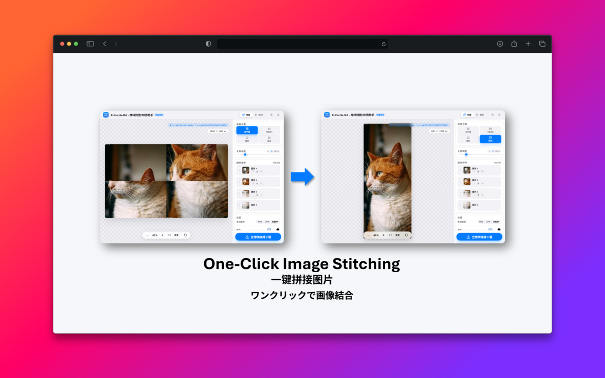
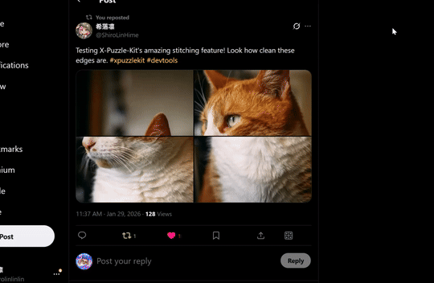
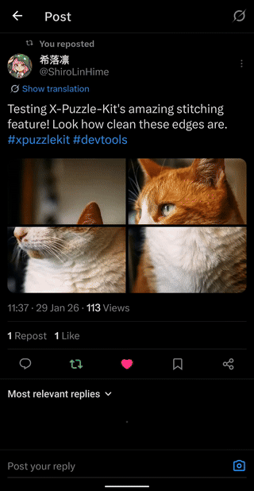
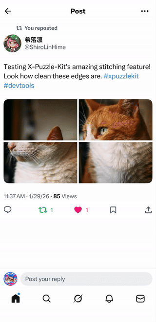

<div align="center">
  

  <h1>X-Puzzle-Kit</h1>
  <p>
    <b>X (Twitter) 创意拼图/拆分工具箱</b>
  </p>
  <p>
    <a href="./README.md">English</a> | <b>简体中文</b>
  </p>

  <p>
    <a href="https://github.com/Shirolin/X-Puzzle-Kit/actions">
      
    </a>
    <a href="https://github.com/Shirolin/X-Puzzle-Kit/releases/latest">
      
    </a>
    
    
  </p>

  <a href="https://x-puzzle-kit.pages.dev">
    
  </a>

  <br/>

  <p>
    <a href="https://x-puzzle-kit.pages.dev">
      
    </a>
    <a href="https://github.com/Shirolin/X-Puzzle-Kit/releases/latest">
      
    </a>
  </p>
</div>

<br/>

## ✨ 核心亮点

<div align="center">
  <table>
    <tr>
      <td align="center" width="33%"><b>Chrome 扩展 (PC)</b></td>
      <td align="center" width="33%"><b>Android (PWA)</b></td>
      <td align="center" width="33%"><b>iOS (Shortcut)</b></td>
    </tr>
    <tr>
      <td></td>
      <td></td>
      <td></td>
    </tr>
    <tr>
      <td align="center" valign="top">✨ <b>信息流按钮嵌入</b><br/>右键快捷拆切</td>
      <td align="center" valign="top">🚀 <b>系统分享直达</b><br/>添加到主屏幕</td>
      <td align="center" valign="top">📲 <b>快捷指令联动</b><br/>官方菜单一键直连</td>
    </tr>
  </table>
  <p><i>从 PC 扩展到移动端 PWA，全平台无缝体验</i></p>
</div>

- **4分割与纵长图**: 专为 X (Twitter) 的 **“4分割纵轴图”** 趋势优化。支持将长图拆分为适配推特流的 4 栏纵向排版（T型或田字格），实现“点击查看全身”的惊艳效果。
- **自定义行列**: 支持自定义 N 行或 N 列的自由切分，适配横幅或超长推文排版，支持 ZIP 打包下载。
- **实时交互**: 拖拽式裁剪区域调整，所见即所得。

### 🖼️ 拼图与收藏 (Stitcher)

- **创意还原**: 看到画师利用推特机制巧妙设计的 4 分割或连载漫画？插件可一键抓取这些奇思妙想，并**物理像素级合成**为一份完整的高清画卷，方便永久收藏。
- **智能布局**: 根据图片数量自动预测最佳布局 (T型、田字格等)，支持原图 (Original) 画质处理。
- **原生集成 (仅限插件)**: 直接在推文下方注入“🧩 拼图”按钮，让“欣赏创意”与“保存经典”一气呵成。

### 📱 跨端 (Platform)

- **深度适配**: 完善的 PWA 支持，针对 iOS/Android 优化的触控界面。
- **即时更新**: 依托 Web 技术栈，前端逻辑支持静默热更新（特别是通过 iOS 快捷指令唤起时），无需等待插件商店审核。
- **系统集成 (仅限移动端)**: 支持从移动端 App 或网页版通过系统“分享”菜单将推文直传工具。Android 端通过 **Web Share Target** 实现，iOS 端通过**快捷指令**实现。

### 🔒 通用 (Core)

- **隐私声明**:
  - **插件版**: 极简设计，**100% 纯本地运行**，不与任何外部服务器通信。
  - **Web/PWA 版**: 推文 URL 解析通过安全代理解理（Cloudflare Worker），**过程不存盘、不记录**，核心图片拼/拆处理依然在本地 Canvas 完成。

## 📦 安装指南

### 方法一：直接使用 Web 版 / PWA (推荐)

无需安装，即点即用！您可以直接访问网页版，并将其“添加到主屏幕”以获得原生 App 般的体验。

- **访问地址**: [https://x-puzzle-kit.pages.dev](https://x-puzzle-kit.pages.dev)
- **特色功能**: 支持在**移动端**通过系统“分享”功能将推文（App 或网页版）直接导入处理。

### 方法二：Chrome 浏览器扩展 (PC 控制台最佳)

这是 PC 用户的最佳体验方式。

1. **前往应用店 (推荐)**: [Chrome 网上应用店 ↗](https://chromewebstore.google.com/detail/x-puzzle-kit-stitch-split/nadlbdmcfmjinifkoedegmiejfibdikk) 点击“添加至 Chrome”。
2. **手动加载 (开发者/备选)**:
   - 前往 [Releases 页面](https://github.com/Shirolin/X-Puzzle-Kit/releases/latest) 下载最新的 `.zip` 文件并解压。
   - 打开 Chrome，访问 `chrome://extensions/` 开启“开发者模式”。
   - 点击“加载已解压的扩展程序”，选择解压后的文件夹。

### 方法三：源码编译安装

如果您是开发者，可以从源码构建：

```bash
git clone https://github.com/Shirolin/X-Puzzle-Kit.git
cd X-Puzzle-Kit
npm install
npm run build      # 构建 Chrome 扩展 (dist)
npm run build:web  # 构建 Web/PWA 版本 (dist-web)
# 扩展版请在 Chrome 加载 dist 目录
```

## 🛠️ 技术栈

本项目基于现代 Web 技术构建，旨在提供极致的性能和开发体验：

- **Framework**: [React](https://react.dev/) + [Preact](https://preactjs.com/) (Lite weight)
- **Language**: [TypeScript](https://www.typescriptlang.org/)
- **Build Tool**: [Vite](https://vitejs.dev/)
- **Components**: [Lucide Icons](https://lucide.dev/), [Sonner](https://sonner.stevenly.me/) (Toasts), [SortableJS](https://sortablejs.com/)
- **Styling**: Vanilla CSS (Apple Design Style) / Scss-like Utilities

## 🔖 版本发布与构建

本项目采用自动化流程管理发布。

### 自动发布

只需推送版本标签，GitHub Actions 会自动打包并发布 Release：

```bash
npm version patch  # 或 minor / major
git push --follow-tags
```

### 手动打包

构建 `.zip` 和 `.crx` 文件：

```bash
npm run package
```

产物将生成在 `release/` 目录下。

## 🤝 贡献与支持

欢迎提交 [Issue](https://github.com/Shirolin/X-Puzzle-Kit/issues) 或 Pull Request！

如果这个项目对您有帮助，请给项目点个 Star ⭐️，或请作者喝杯咖啡：

- [爱发电 (Afdian)](https://ifdian.net/a/shirolin)
- [Ko-fi](https://ko-fi.com/shirolin)

## 📄 许可证

[GPL-3.0](./LICENSE) License © 2026 shirolin
