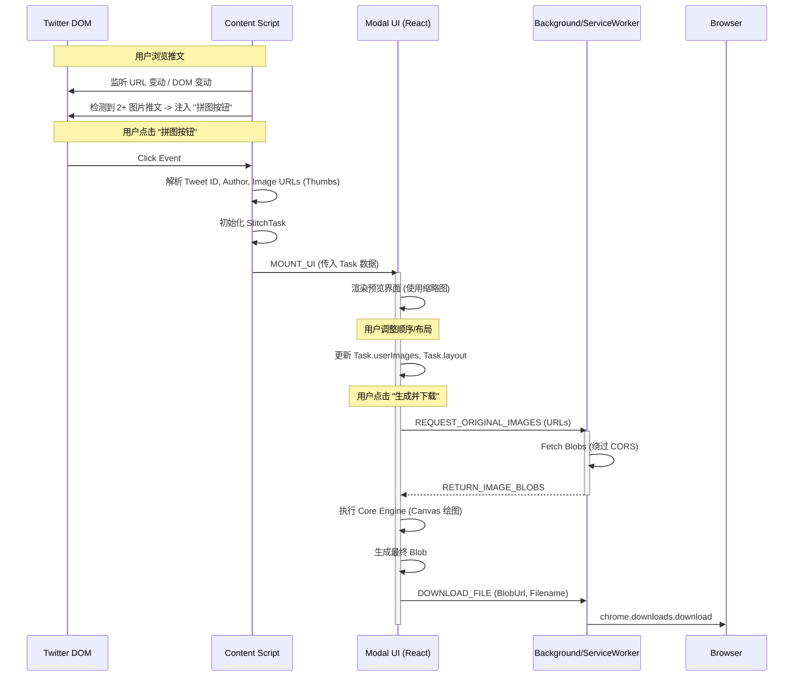

# X-Puzzle-Stitcher 详细设计文档

本稳当基于《产品需求文档 (PRD) v1.0》编写，详细阐述 X-Puzzle-Stitcher (推特拼图还原助手) 的技术实现方案。

## 1. 技术架构 (Technical Architecture)

本项目采用 **Browser Extension (Manifest V3)** 架构开发，支持 Chrome/Edge 等主流浏览器。

### 1.1 模块划分

| 模块                            | 职责描述                                                        | 技术选型                                |
| ------------------------------- | --------------------------------------------------------------- | --------------------------------------- |
| **Content Script**              | 注入 Twitter 页面，负责 DOM 监听、图片 URL 提取、挂载 UI 容器。 | TypeScript, Native DOM API              |
| **Service Worker (Background)** | 负责跨域请求 (如果需要)、图片下载代理、扩展生命周期管理。       | TypeScript                              |
| **Popup/In-Page Modal**         | 用户交互界面：预览拼图、调整布局、拖拽排序、设置选项。          | React/Preact, Shadow DOM (避免样式污染) |
| **Core Engine**                 | 纯逻辑层：包含布局算法、图片规范化算法、Canvas 合成逻辑。       | TypeScript (平台无关，易于移植)         |

### 1.2 开发工具链

- **语言**: TypeScript (严格模式)
- **构建工具**: Vite (快速构建，支持 HMR)
- **UI 框架**: Preact (轻量级，适合嵌入式插件) + Tailwind CSS (Scoped)
- **包管理**: pnpm

---

## 2. 数据结构设计 (Data Structures)

### 2.1 基础模型

#### ImageNode (单张图片对象)

```typescript
interface ImageNode {
  id: string; // 唯一标识 (UUID 或 Index)
  originalUrl: string; // 原图 URL (name=orig)
  thumbnailUrl: string; // 缩略图 URL (用于预览)
  width: number; // 原始宽度
  height: number; // 原始高度
  rotation: 0 | 90 | 180 | 270; // 旋转角度
}
```

#### StitchLayout (布局配置)

```typescript
type LayoutType =
  | "GRID_2x2"
  | "VERTICAL_1xN"
  | "HORIZONTAL_Nx1"
  | "VERTICAL_1x2"
  | "CUSTOM";

interface StitchLayout {
  type: LayoutType;
  rows: number;
  cols: number;
  // 对于非规则网格，可能需要更复杂的结构，目前 P0/P1 先支持规则网格
}
```

#### StitchTask (拼接任务 - 核心对象)

```typescript
interface StitchTask {
  taskId: string;
  tweetId: string;
  artistHandle: string; // 画师 ID (@username)
  sourceImages: ImageNode[]; // 原始抓取的图片列表 (按 DOM 顺序)

  // 用户编辑状态
  userImages: ImageNode[]; // 用户排序/编辑后的图片列表
  layout: StitchLayout; // 当前选中的布局

  // 输出配置
  outputFormat: "png" | "jpg";
  status: "IDLE" | "LOADING" | "GENERATING" | "SUCCESS" | "ERROR";
}
```

---

## 3. 核心算法设计 (Core Algorithms)

### 3.1 布局推荐算法 (Layout Recommendation)

输入：图片数量 $N$，图片尺寸列表 $[(w_1, h_1), ..., (w_n, h_n)]$

1.  **Unique Count Check**:
    - IF $N=4$: return `GRID_2x2` (默认田字格)
    - IF $N=3$: return `HORIZONTAL_3x1` (临时策略，P1 细化 T 型布局)
2.  **Pair Check (N=2)**:
    - 计算平均宽高比 $R_{avg} = \frac{\sum (w_i/h_i)}{N}$
    - IF $R_{avg} < 0.8$ (显著竖长): return `HORIZONTAL_2x1` (横拼)
    - IF $R_{avg} > 1.2$ (显著横长): return `VERTICAL_1x2` (竖拼)
    - ELSE: return `HORIZONTAL_2x1` (默认)
3.  **Others**: return `HORIZONTAL_Nx1`

### 3.2 尺寸归一化算法 (Normalization Logic) - F2.2 实现

为防止拼接产生错位，必须将同维度的边长对齐。以 **水平拼接 (Horizontal Stitching)** 两张图 A 和 B 为例：

1.  **设定基准**: 以第一张图 A 的高度 $H_A$ 为基准高度 $H_{target}$。
2.  **计算缩放比**: 计算图 B 的缩放比例 $Scale_B = H_{target} / H_B$。
3.  **应用缩放**:
    - 图 A: $W'_A = W_A, H'_A = H_A$
    - 图 B: $W'_B = W_B * Scale_B, H'_B = H_B * Scale_B (= H_A)$
4.  **合成画布**:
    - 总宽 $W_{total} = W'_A + W'_B$
    - 总高 $H_{total} = H_A$
    - 绘制: Draw A at $(0, 0)$, Draw B at $(W'_A, 0)$

**垂直拼接 (Vertical Stitching)** 逻辑同理，以**宽度**为基准进行对齐。

**2x2 田字格逻辑**:

1.  先处理 Row 1 (图1, 图2): 按水平拼接逻辑对齐高度，$H_{row1} = \max(H'_1, H'_2)$ (或取基准)。
2.  先处理 Row 2 (图3, 图4): 按水平拼接逻辑对齐高度，$H_{row2}$。
3.  将 Row 1 和 Row 2 进行**垂直拼接**：以 Row 1 的总宽为基准，缩放 Row 2。

---

## 4. 组件通信设计 (Component Communication)

使用 `chrome.runtime.sendMessage` 和 `window.postMessage` (如果涉及到 Inject Script) 进行通信。

### 4.1 通信流程图 (Sequence)



---

## 5. 项目目录结构 (Project Structure)

```
/src
  /background    # Service Worker
    index.ts
  /content       # Content Script
    index.ts     # 入口，DOM 观察者
    parser.ts    # 解析推特 DOM
  /ui            # React UI
    App.tsx
    components/
      Editor.tsx
      PreviewCanvas.tsx
  /core          # 核心算法 (无 DOM/UI 依赖)
    stitcher.ts  # Canvas 绘制逻辑
    layout.ts    # 布局推荐
    utils.ts
  /manifest.json
```

## 6. 验证计划 (Verification Plan)

### 6.1 自动化测试 (Unit Tests)

- **布局算法测试**: 针对 `layout.ts`，输入不同尺寸的 Mock 图片数组，断言返回的布局类型符合预期 (如 4 张图返田字格)。
- **归一化计算测试**: 输入两张不同高度的图片，验证计算出的缩放后尺寸是否高度一致。

### 6.2 手动集成测试

- **场景 1 (基础)**: 找到一个 4 张图的推文，点击拼图，确认默认展示 2x2 布局，生成的图片无错位。
- **场景 2 (长图)**: 找到被切分为 2 张的长条漫，测试自动识别为 vertical 拼接，生成长图。
- **场景 3 (排序)**: 在 UI 中拖拽图片交换位置 1 和 4，确认生成结果对应位置改变。
- **场景 4 (下载)**: 确认下载的文件名包含 Author 和 TweetID，文件格式正确。

## 7. 风险应对 (Risks)

- **DOM 变更**: `parser.ts` 需独立封装，使用多个特征值 (data-testid, aria-label) 定位，而非单一 class。
- **跨域图片**: 图片通过 Background 脚本 fetch 后转 Blob URL 传回前端，或直接在 Content Script 如果 CSP 允许 (Twitter CSP 较严，通常需 Background 中转)。
